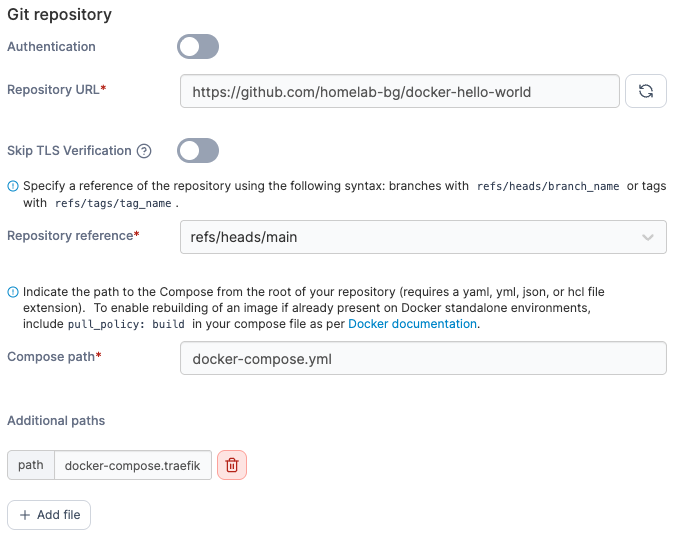

# ntfy

A self-hosted ntfy application with support for both standalone and Traefik reverse proxy deployments.

## Services Included

- **ntfy**: Self-hosted push notification solution
- **Persistent Storage**: Push notification data and configuration stored in Docker volume
- **Status Page**: Public status pages for your services

## Quick Start

**Copy environment template:**
```bash
cp .env.example .env
```

## Deployment Options

### Standalone Deployment
Direct access via host ports:
```bash
docker compose up -d
```
Access at: http://localhost

### Traefik Integration
Deploy with reverse proxy integration:
```bash
docker compose -f docker-compose.yml -f docker-compose.traefik.yml up -d
```
Access at: https://ntfy.yourdomain.com (with automatic TLS)

## Portainer Deployment

When deploying from GitHub in Portainer:

1. **Compose path**: `docker-compose.yml`
2. **Additional paths**: Click "Add file" and enter `docker-compose.traefik.yml`



This configures Portainer to merge both files, equivalent to:
```bash
docker compose -f docker-compose.yml -f docker-compose.traefik.yml up -d
```

## Prerequisites

### Standalone
- Docker & Docker Compose

### Traefik Integration  
- Docker & Docker Compose
- External `traefik` network
- Traefik instance with Let's Encrypt configured

## Configuration

### Environment Variables
See `.env.example` for all available configuration options.

**Key Settings:**
- `NTFY_VER`: ntfy version (default: 2.15)
- `TRAEFIK_HOST`: Your domain name
- `TRAEFIK_PORT`: Service port (default: 80)

## About nfty
